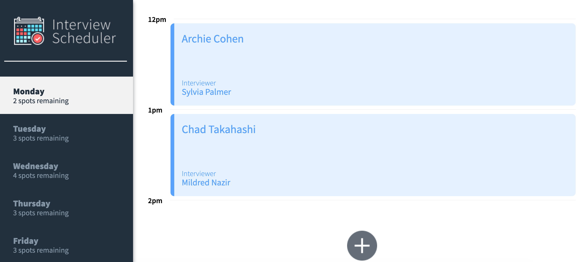
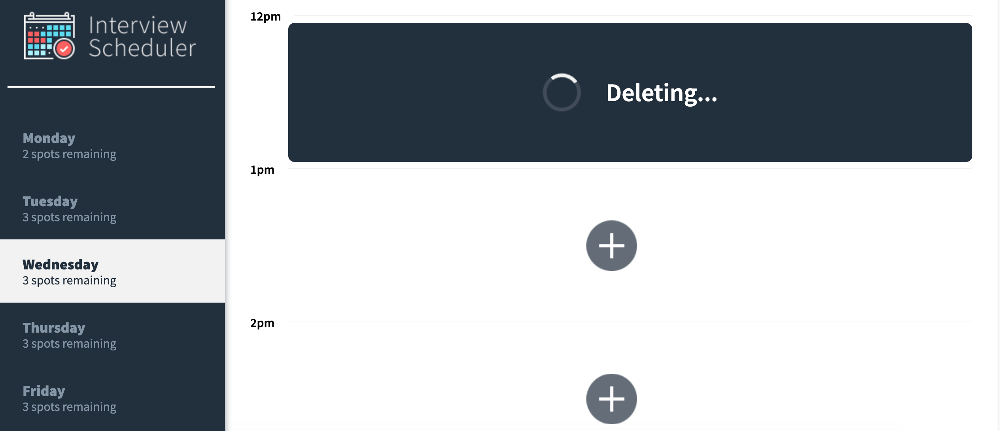
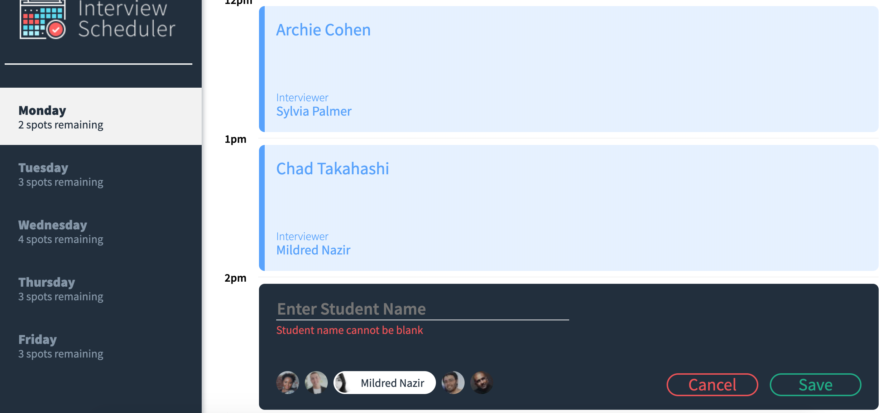
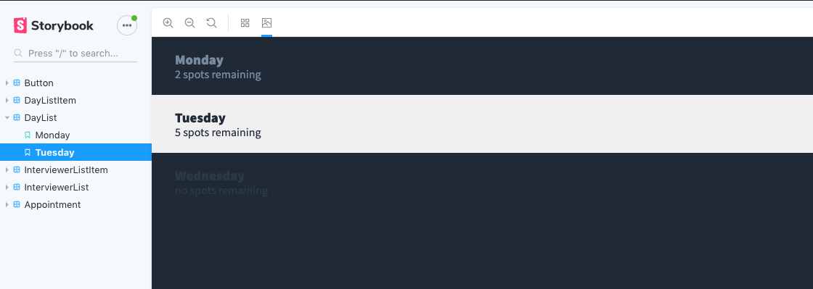
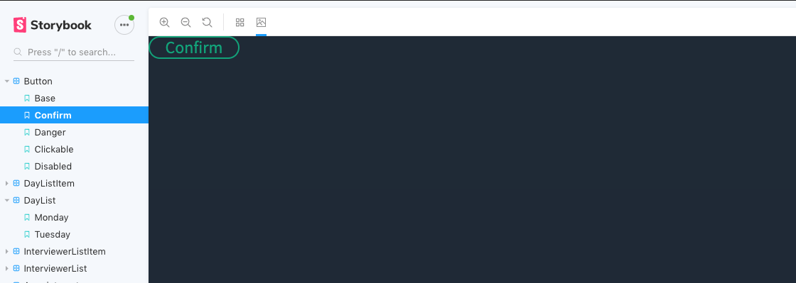
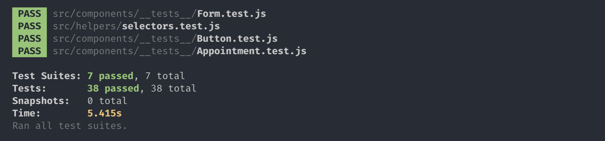

# INTERVIEW SCHEDULER
Single page application using **React**.
Allows the user to book an appointment with an interview.

Testing frameworks used: **jest** and **storybook**.

# ```DEPENDENCIES```

- axios
- classnames
- react
- react-dom
- react-scripts

## **REACT**

```
Home Page
```

```
Deleting a Record
```

```
Error if no student name entered
```


## **STORYBOOK**
```
Story book example 1 - daylist
```

```
Story book example 2 - daylist
```


## **JESTS**
```
Jests tests all passing
```
